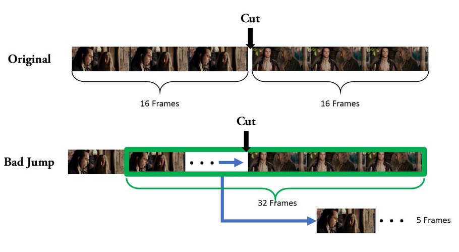
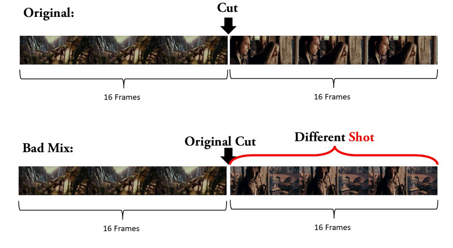
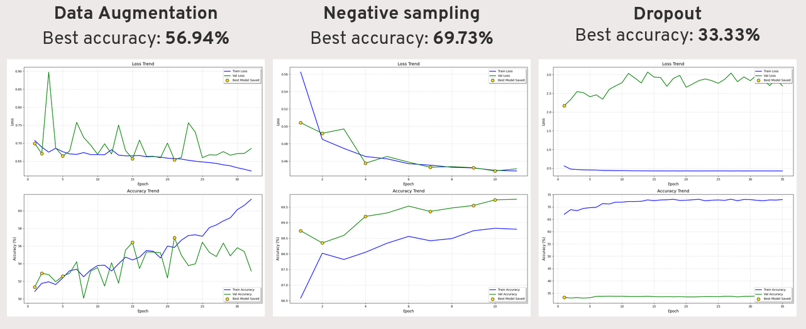

# Bad-or-Good-Cut
Binary classification for good or bad cut videos in the scenes

Research for University of Nantes

## Project objective

The goal of the project was to train a model with pre-trained weights to recognize a good or bad cut of a movie scene following the best practices of video editing.
*We didn't consider the audio in this project.*

## Data
In film scenes we had only good cuts, so we needed to create artificially bad cuts.
To create the bad cuts in one case we skipped the cut point by 5 frames in the second case we joined 2 different pieces of the same scene.

**Bad jump**


**Bad mix**


In our project we had 375,000 cuts of total, we got videos from MovieCuts project, but we recommand to re-create the database from scratch.

## Buildings

**ResNet** was the Deep learning architecture used in this project. ResNet is a Convolutional Neural Network (CNN), so perfect for tasks in computer vision.

We used a 18 layers version, with R(2+1)D pre-trained weights on Kinetics-400 dataset (a dataset with 400 differents human actions) and a Batch size 4, but we recommend to use at least 8 if possible.

We introduced also Learning Rate Scheduler to help model to converge, L2 Regularization against overfitting and Cost-Sensitive Learning to privilege some classes.

**In main.ipynb you can find all code, but not all parameters are the same used in training phase.**

## Some Results

Results were not encouraging.

We tried Dropout, Data Augmentation and Negative Sampling training and we got the best values in validation phases with Negative Sampling technique:


Even if the training on biggest dataset gave a good results in real life we had only 56% of accuracy.

We suspect **Data Shift Problem**, infact the model, although not overfitting, was strong in validation at guessing videos it had never seen, but were part of the same database, therefore videos exported with the same encoding, but was not effective ad all on new videos.

Our database was built from the database provided by MovieCuts, but we recommend rebuilding it from scratch to address this type of issue.

## How to use

- main.ipynb to start training
- Create a folder with some cuts, called test_folder, and to test the model : ```python3 test.py```

NB: We give our model with the bests performance to try it, but you can do better!